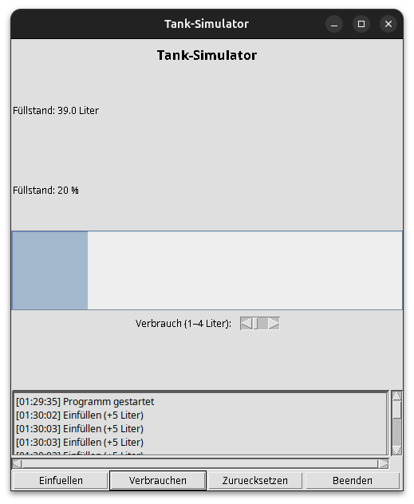

# Tank Simulator (JavaFX)



Tank Simulator is a small desktop application that simulates a fuel tank with a simple GUI. It demonstrates a clean MVC-style separation, basic state management, and UI updates tied to user actions. The app lets you fill, consume, and reset a tank while showing the current level in liters and percent, plus a progress bar and log.

## Table of Contents

- [Overview](#overview)
- [Features](#features)
- [Technology Stack](#technology-stack)
- [Project Structure](#project-structure)
- [How It Works](#how-it-works)
- [Model Details](#model-details)
- [UI Layout](#ui-layout)
- [Logging](#logging)
- [Build and Run](#build-and-run)
- [Configuration](#configuration)
- [Troubleshooting](#troubleshooting)
- [License](#license)

## Overview

The application models a single tank with a maximum capacity of 200 liters. The UI includes buttons for filling and consuming, a scrollbar to choose a consumption amount, and a log window. The state is stored in the model and pushed to the UI after each action.

## Features

- Fill the tank by a fixed amount (+5 liters).
- Consume a variable amount (1-4 liters).
- Reset the tank to 0 liters.
- Live status labels in liters and percent.
- Progress bar that tracks fill level.
- Session log displayed in-app and written to disk.

## Technology Stack

- Java 17
- Maven
- JavaFX UI
- MVC-style package separation

## Project Structure

```
.
├── Info/
│   └── mvn_commands.txt
├── Screenshots/
│   └── Tanksimulator_Screenshot.png
├── logs/
│   └── tank_log_YYYY-MM-DD_HH-mm-ss.txt
├── src/
│   └── main/
│       └── (source files not present in this repo snapshot)
├── target/
│   └── classes/
│       └── de/futurehome/tanksimulator/
│           ├── controller/MyActionListener.class
│           ├── model/Tank.class
│           └── view/TankSimulator.class
├── pom.xml
└── README.md
```

Notes:
- The compiled classes live under `target/classes`.
- The repository snapshot does not include the original Java source files under `src/main`.
- The UI screenshot is stored in `Screenshots/`.

## How It Works

The application follows an MVC-like layout:

- **Model** (`de.futurehome.tanksimulator.model.Tank`)
  - Holds the tank level (`fuellstand`) and enforces limits with a clamp method.
- **View** (`de.futurehome.tanksimulator.view.TankSimulator`)
  - Renders the UI, manages layout, and updates labels/progress.
- **Controller** (`de.futurehome.tanksimulator.controller.MyActionListener`)
  - Handles button events and calls the model, then updates the view.

Interaction flow:
1. User clicks a button in the UI.
2. Controller maps the action to the model (fill, consume, reset).
3. View refreshes the displayed values and progress bar.
4. A log line is appended to the UI log and written to a file.

## Model Details

**Tank capacity**
- `MAX_FUELLSTAND = 200.0` liters

**State**
- `fuellstand` (double) is the current fill level in liters.

**Operations**
- `fuellen()` adds 5 liters.
- `verbrauchen(double liter)` subtracts the given amount.
- `reset()` sets the level to 0.
- `clamp(double value)` keeps `fuellstand` between 0 and 200.

The model always clamps values, so the tank never goes below 0 or above 200.

## UI Layout

The UI is built with JavaFX components:

- **Top**: Title label "Tank-Simulator"
- **Center**:
  - Current fill level label (liters)
  - Current fill level as percent (0-100%)
  - Progress bar (0-200)
  - Consumption slider (1-4 liters)
  - Log area (read-only)
- **Bottom**: Buttons
  - `Einfuellen` (Fill +5 liters)
  - `Verbrauchen` (Consume selected liters)
  - `Zuruecksetzen` (Reset to 0)
  - `Beenden` (Exit)

The UI calls `updateUI()` after each action to refresh labels and the progress bar.

## Logging

Each session creates a log file in `logs/` with a timestamped name:

```
logs/tank_log_YYYY-MM-DD_HH-mm-ss.txt
```

Log lines include the local time and the action, for example:
- `12:34:56 - Einfuellen (+5 Liter)`
- `12:35:12 - Verbrauchen (3 Liter)`
- `12:35:40 - Tank zurueckgesetzt`

The same log lines are shown in the UI text area.

## Build and Run

Requirements:
- Java 17
- Maven

Run the app:

```bash
mvn exec:java
```

The main class is configured in `pom.xml`:

```
de.futurehome.tanksimulator.view.TankSimulator
```

## Configuration

There is no runtime configuration file. All parameters are in code:

- Max tank capacity: 200 liters
- Fill step: +5 liters
- Consume range: 1-4 liters (from scrollbar)

If you want to change these, update the model and UI logic in the Java sources.

## Troubleshooting

- **No UI appears**: Verify Java 17 is installed and that you can run AWT/Swing apps on your system.
- **Logs folder missing**: The app creates `logs/` on startup. If it fails, check write permissions.
- **Maven errors**: Run `mvn -v` to confirm Maven and Java versions.

## License

This project has no copyright and is free to use for any purpose.
